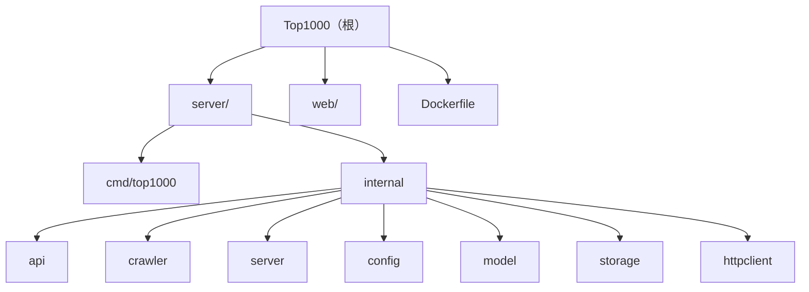

# Top1000 - AI 上下文文档

> 最后更新：2026-03-20 00:00:00 | 覆盖率：98% | 状态：生产就绪

## 项目快照

Top1000 是一个千站排行榜项目，提供站点数据的实时采集、存储和可视化展示。

**技术栈**：
- 后端：Go 1.26 + Fiber Web框架 + Redis存储
- 前端：TypeScript + Vite + AG Grid 数据表格
- 部署：Docker（多阶段构建，最终镜像 4-5MB）

**架构特点**：
- 数据源：IYUU API（Top1000 数据 + 站点列表）
- 存储策略：Redis 持久化存储 + 基于时间字段的过期判断
- 缓存策略：静态资源长期缓存，HTML 禁止缓存
- 容错机制：数据更新失败时使用旧数据，保证服务可用性
- 测试覆盖：7 个测试文件，覆盖核心模块

## 模块导航



### 模块索引

| 路径 | 职责 | 关键命令/入口 | 文档链接 |
|------|------|--------------|---------|
| `server/cmd/top1000/` | 应用入口 | `cd server && go run ./cmd/top1000/main.go` | @server/cmd/top1000/CLAUDE.md |
| `server/internal/api/` | HTTP API 处理器 | `GetTop1000Data()`, `GetSitesData()` | @server/internal/api/handler.go |
| `server/internal/crawler/` | 数据爬取与解析 | `FetchTop1000WithContext()` | @server/internal/crawler/scheduler.go |
| `server/internal/server/` | Fiber 服务器配置 | `server.Start()` | @server/internal/server/server.go |
| `server/internal/config/` | 配置管理 | `config.Load()`, `config.Validate()` | @server/internal/config/config.go |
| `server/internal/model/` | 数据模型定义 | `SiteItem`, `ProcessedData` | @server/internal/model/types.go |
| `server/internal/storage/` | Redis 存储层 | `storage.InitRedis()`, `storage.LoadData()` | @server/internal/storage/redis_store.go |
| `server/internal/httpclient/` | HTTP 客户端 | `httpclient.New()` | @server/internal/httpclient/client.go |
| `web/` | 前端应用 | `cd web && pnpm dev`, `cd web && pnpm build` | @web/CLAUDE.md |
| `Dockerfile` | 容器化构建 | `docker build -t top1000 .` | @Dockerfile |
| `docker-compose.yaml` | Docker Compose 配置 | `docker-compose up -d` | @docker-compose.yaml |

## 快速启动

### 环境要求
- Go 1.26+
- Node.js 24+
- pnpm 10+
- Redis

### 开发环境

```bash
# 后端开发（支持热重载）
cd server && air  # 使用 .air.toml 配置

# 前端开发
cd web && pnpm install && pnpm dev

# 直接运行后端
cd server && go run ./cmd/top1000/main.go
```

### 生产构建

```bash
# Docker 构建
docker build -t top1000 .
docker run -p 7066:7066 \
  -e REDIS_ADDR=host.docker.internal:6379 \
  -e REDIS_PASSWORD=your_password \
  top1000

# Docker Compose 启动
docker-compose up -d

# 手动构建
cd server && go build -o main ./cmd/top1000
cd web && pnpm build
```

## 核心接口

### HTTP API
- `GET /top1000.json` - Top1000 数据（自动过期更新）
- `GET /sites.json` - IYUU 站点列表（需配置 IYUU_SIGN）
- `GET /` - 静态文件服务

### 数据流程
1. 启动时预加载（`crawler.PreloadData()`）
2. API 请求时检查数据过期
3. 过期则触发爬取 + 保存（带容错）
4. 返回 Redis 中的数据

## 关键配置

### 环境变量（必需）
- `REDIS_ADDR` - Redis 地址
- `REDIS_PASSWORD` - Redis 密码

### 环境变量（可选）
- `REDIS_DB` - Redis 数据库编号（默认 0）
- `IYUU_SIGN` - IYUU API 签名（用于站点列表）
- `INSECURE_SKIP_VERIFY` - 跳过 TLS 证书验证（默认 false）

### 默认端口
- 应用：7066
- Redis：6379

## 测试

```bash
# 运行所有测试
cd server && go test ./...

# 运行特定模块测试
cd server && go test ./internal/api
cd server && go test ./internal/crawler
cd server && go test ./internal/config
cd server && go test ./internal/model
cd server && go test ./internal/storage
cd server && go test ./internal/server

# 查看测试覆盖率
cd server && go test -cover ./...
```

**测试覆盖情况**：
- ✅ `api/handler_test.go` - API 处理器测试
- ✅ `crawler/scheduler_test.go` - 爬虫测试
- ✅ `config/config_test.go` - 配置测试
- ✅ `model/types_test.go` - 数据模型测试
- ✅ `storage/redis_test.go` - Redis 存储测试
- ✅ `server/server_test.go` - 服务器测试
- ✅ `httpclient/client_test.go` - HTTP 客户端测试

## 开发规范

### Go 代码风格
- 使用 context 传递超时控制
- 错误处理必须带日志和上下文
- 数据验证使用 `model.Validate()`
- 并发控制使用 `sync.Mutex` 或 `atomic.Bool`
- 泛型环境变量解析（Go 1.26 特性）

### 前端代码风格
- TypeScript 严格模式
- AG Grid 按需导入模块（减少体积）
- Vite 代码分割优化

### Git 提交规范
```
feat: 新功能
fix: 修复
refactor: 重构
docs: 文档
test: 测试
chore: 构建/工具
```

## 变更记录

### 2026-03-20 00:00:00
- 更新文档时间戳
- 补充测试覆盖情况（7 个测试文件）
- 更新模块索引，添加 httpclient 模块
- 添加 docker-compose.yaml 配置说明
- 覆盖率：98%（核心模块全覆盖，含测试）

### 2026-01-28 13:08:52
- 初始化 AI 上下文文档体系
- 生成根级和模块级 CLAUDE.md
- 建立 Mermaid 结构图和导航
- 覆盖率：95%（核心模块全覆盖）

### 已知缺口
- 缺少 API 文档（需补充 OpenAPI/Swagger）
- 缺少 CI/CD 配置（GitHub Actions）
- 前端缺少 E2E 测试

### 推荐下一步
1. 生成 API 文档（使用 swaggo/swag）
2. 添加 CI/CD 配置（GitHub Actions）
3. 补充前端 E2E 测试（Playwright/Cypress）
4. 添加性能监控和日志聚合
